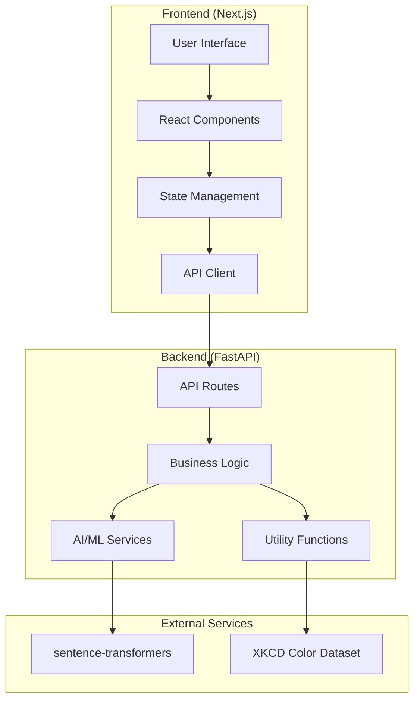

# Design Document

## Overview

ChromaCraft is architected as a modern web application with a React/Next.js frontend and FastAPI backend, designed to provide seamless color palette generation through multiple AI-powered methods. The system emphasizes performance, user experience, and extensibility while maintaining clean separation of concerns between presentation, business logic, and data processing layers.

## Architecture

### High-Level Architecture



### Technology Stack

**Frontend:**
- Next.js 14+ with App Router for server-side rendering and routing
- React 18+ with hooks for component state management
- TypeScript for type safety and developer experience
- Tailwind CSS for utility-first styling and responsive design
- Native browser APIs for file handling and clipboard operations

**Backend:**
- FastAPI for high-performance async API development
- Pydantic for data validation and serialization
- Pillow (PIL) for image processing and manipulation
- scikit-learn for KMeans clustering and color extraction
- sentence-transformers for AI-powered mood matching
- colorsys for color space conversions (HSL, RGB, HEX)

**Data & AI:**
- XKCD color dataset for human-readable color names
- Pre-curated mood palette dataset for AI matching
- Sentence-transformers model for text embedding generation
- Cosine similarity for palette matching algorithms

## Components and Interfaces

### Frontend Components

#### Core Components

**PaletteGenerator**
- Manages overall palette generation state
- Coordinates between different generation methods
- Handles palette locking and regeneration logic
- Props: `onPaletteChange`, `initialPalette`
- State: `currentPalette`, `lockedColors`, `generationMethod`

**ColorSwatch**
- Displays individual colors with HEX codes and names
- Handles color locking/unlocking interactions
- Shows accessibility information (contrast ratios)
- Props: `color`, `name`, `locked`, `onToggleLock`, `showAccessibility`

**ImageUploader** (existing)
- Handles drag-and-drop and file selection
- Provides upload progress and error feedback
- Integrates with backend color extraction API
- Enhanced with better error handling and file validation

**MoodInput** (existing)
- Text input for mood descriptions
- Quick suggestion buttons for common moods
- Real-time mood processing and palette generation
- Enhanced with debouncing and loading states

**PromptEditor**
- Natural language palette editing interface
- Predefined command suggestions ("make it pastel", "add contrast")
- Real-time preview of editing effects
- Props: `currentPalette`, `onPaletteEdit`

**ExportPanel**
- Multiple export format options (PNG, JSON, ASE, clipboard)
- Export progress and success/error feedback
- Customizable export settings (size, format options)
- Props: `palette`, `colorNames`

#### Layout Components

**AppLayout**
- Main application shell with responsive design
- Navigation and branding elements
- Error boundary for graceful error handling

**PaletteDisplay**
- Grid layout for color swatches
- Responsive design for mobile and desktop
- Accessibility features (keyboard navigation, screen reader support)

### Backend API Endpoints

#### Color Generation Endpoints

**POST /generate/random**
- Generates random harmonious color palette
- Request: `{ locked_colors?: string[], harmony_type?: string }`
- Response: `{ colors: string[], names: string[], harmony_info: object }`

**POST /generate/mood**
- Generates palette based on mood description
- Request: `{ mood: string, style_preferences?: object }`
- Response: `{ colors: string[], names: string[], confidence: number, mood_match: string }`

**POST /extract-colors** (existing, enhanced)
- Extracts colors from uploaded images
- Request: Multipart form data with image file
- Response: `{ colors: string[], names: string[], dominant_info: object }`
- Enhanced with better error handling and image optimization

#### Palette Editing Endpoints

**POST /edit/palette**
- Applies natural language edits to existing palette
- Request: `{ colors: string[], command: string, intensity?: number }`
- Response: `{ colors: string[], names: string[], edit_applied: string }`

**POST /validate/accessibility**
- Validates palette for accessibility compliance
- Request: `{ colors: string[] }`
- Response: `{ contrast_ratios: object[], wcag_compliance: object, suggestions: string[] }`

#### Export Endpoints

**POST /export/png**
- Generates PNG swatch card
- Request: `{ colors: string[], names: string[], format_options: object }`
- Response: Binary PNG data with appropriate headers

**POST /export/ase**
- Generates Adobe Swatch Exchange file
- Request: `{ colors: string[], names: string[] }`
- Response: Binary ASE data with appropriate headers

**GET /export/json**
- Returns structured JSON palette data
- Query params: colors, names
- Response: `{ palette: object, metadata: object }`

### Data Models

#### Frontend Types

```typescript
interface ColorPalette {
  colors: string[];
  names: string[];
  metadata: {
    generationMethod: 'random' | 'mood' | 'image' | 'edited';
    timestamp: string;
    source?: string;
  };
}

interface ColorInfo {
  hex: string;
  name: string;
  locked: boolean;
  accessibility?: {
    contrastRatio: number;
    wcagLevel: 'AA' | 'AAA' | 'fail';
  };
}

interface MoodGenerationRequest {
  mood: string;
  stylePreferences?: {
    saturation: 'low' | 'medium' | 'high';
    brightness: 'dark' | 'medium' | 'light';
    temperature: 'cool' | 'neutral' | 'warm';
  };
}

interface PaletteEditRequest {
  colors: string[];
  command: string;
  intensity?: number; // 0.1 to 1.0
}
```

#### Backend Models

```python
from pydantic import BaseModel, Field
from typing import List, Optional, Literal

class ColorPalette(BaseModel):
    colors: List[str] = Field(..., description="List of HEX color codes")
    names: List[str] = Field(..., description="Human-readable color names")
    metadata: dict = Field(default_factory=dict)

class MoodRequest(BaseModel):
    mood: str = Field(..., min_length=1, max_length=200)
    style_preferences: Optional[dict] = None

class EditRequest(BaseModel):
    colors: List[str] = Field(..., min_items=1, max_items=10)
    command: str = Field(..., min_length=1, max_length=100)
    intensity: Optional[float] = Field(default=0.5, ge=0.1, le=1.0)

class ExportRequest(BaseModel):
    colors: List[str]
    names: List[str]
    format_options: Optional[dict] = None
```

## Error Handling

### Frontend Error Handling

**Error Boundary Component**
- Catches and displays React component errors gracefully
- Provides fallback UI with retry mechanisms
- Logs errors for debugging purposes

**API Error Handling**
- Standardized error response format
- User-friendly error messages with actionable guidance
- Retry logic for transient failures
- Offline detection and graceful degradation

**Validation Errors**
- Real-time form validation with clear feedback
- File upload validation (size, type, corruption)
- Color format validation for manual inputs

### Backend Error Handling

**HTTP Exception Handling**
- Standardized error response format across all endpoints
- Appropriate HTTP status codes (400, 422, 500, etc.)
- Detailed error messages for development, sanitized for production

**File Processing Errors**
- Image corruption detection and handling
- File size and format validation
- Memory management for large image processing

**AI/ML Error Handling**
- Model loading failure recovery
- Graceful degradation when AI services are unavailable
- Fallback to rule-based approaches when possible

```python
class APIError(Exception):
    def __init__(self, message: str, status_code: int = 500, details: dict = None):
        self.message = message
        self.status_code = status_code
        self.details = details or {}

@app.exception_handler(APIError)
async def api_error_handler(request: Request, exc: APIError):
    return JSONResponse(
        status_code=exc.status_code,
        content={
            "error": exc.message,
            "details": exc.details,
            "timestamp": datetime.utcnow().isoformat()
        }
    )
```

## Testing Strategy

### Frontend Testing

**Unit Testing**
- Jest and React Testing Library for component testing
- Test color utility functions and validation logic
- Mock API calls for isolated component testing
- Coverage target: 80%+ for utility functions and critical components

**Integration Testing**
- Test component interactions and state management
- API integration testing with mock backend
- File upload and drag-and-drop functionality testing

**E2E Testing**
- Playwright for full user journey testing
- Critical path testing (generate → edit → export)
- Cross-browser compatibility testing
- Mobile responsiveness testing

### Backend Testing

**Unit Testing**
- pytest for comprehensive API endpoint testing
- Test color processing algorithms and utilities
- Mock external dependencies (AI models, file system)
- Coverage target: 90%+ for business logic

**Integration Testing**
- Test complete API workflows
- Database integration testing (if applicable)
- File processing pipeline testing
- AI model integration testing

**Performance Testing**
- Load testing for image processing endpoints
- Memory usage testing for large image handling
- Response time benchmarking for AI operations

### Test Data and Fixtures

**Color Test Data**
- Predefined color palettes for consistent testing
- Edge cases (very dark, very light, similar colors)
- Invalid color formats for validation testing

**Image Test Data**
- Various image formats and sizes
- Corrupted files for error handling testing
- Images with different color distributions

**Mood Test Data**
- Common mood descriptions and expected outputs
- Edge cases and unusual mood descriptions
- Multi-language mood inputs (future consideration)

### Continuous Integration

**Automated Testing Pipeline**
- Run all tests on pull requests
- Separate test environments for frontend and backend
- Performance regression testing
- Security vulnerability scanning

**Quality Gates**
- Minimum test coverage requirements
- Code quality metrics (ESLint, Prettier, Black)
- Type checking (TypeScript, mypy)
- Accessibility testing (axe-core)

## Performance Considerations

### Frontend Optimization

**Code Splitting**
- Lazy loading of non-critical components
- Dynamic imports for export functionality
- Route-based code splitting with Next.js

**Image Optimization**
- Next.js Image component for automatic optimization
- WebP format support with fallbacks
- Responsive image loading

**State Management**
- Efficient re-rendering with React.memo and useMemo
- Debounced API calls for real-time features
- Local storage for palette history and preferences

### Backend Optimization

**Image Processing**
- Image resizing before color extraction
- Efficient memory management for large files
- Caching of processed results

**AI Model Optimization**
- Model loading optimization and caching
- Batch processing for multiple requests
- GPU acceleration when available

**API Performance**
- Async/await for non-blocking operations
- Connection pooling for external services
- Response compression and caching headers

## Security Considerations

### File Upload Security

**File Validation**
- Strict file type checking beyond MIME types
- File size limits and virus scanning
- Image header validation to prevent malicious files

**Processing Security**
- Sandboxed image processing environment
- Memory limits for image operations
- Timeout limits for processing operations

### API Security

**Input Validation**
- Pydantic models for request validation
- SQL injection prevention (if database is added)
- XSS prevention in error messages

**Rate Limiting**
- Request rate limiting per IP address
- Stricter limits for resource-intensive operations
- Graceful degradation under high load

### Data Privacy

**User Data Handling**
- No persistent storage of uploaded images
- Temporary file cleanup after processing
- No tracking of user-generated palettes without consent